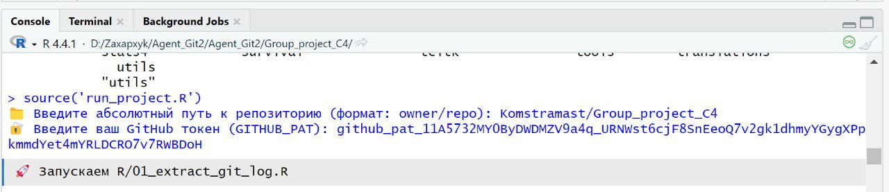
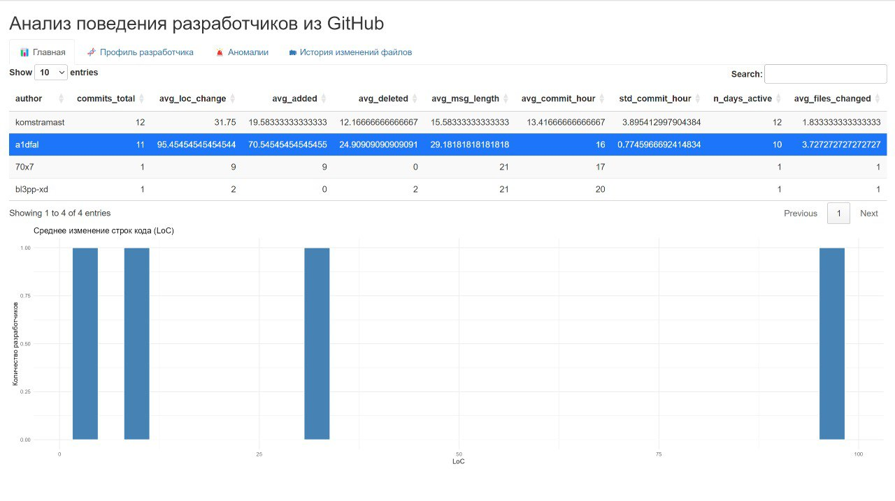
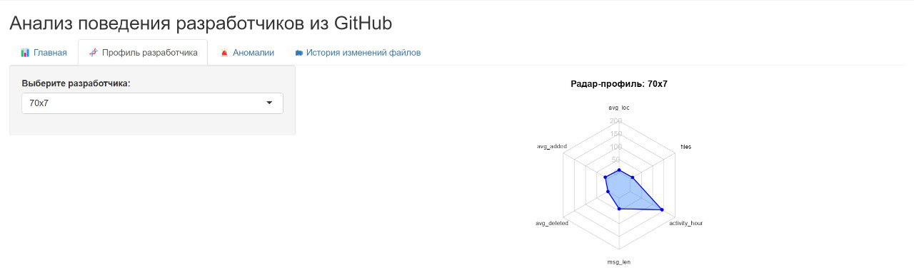
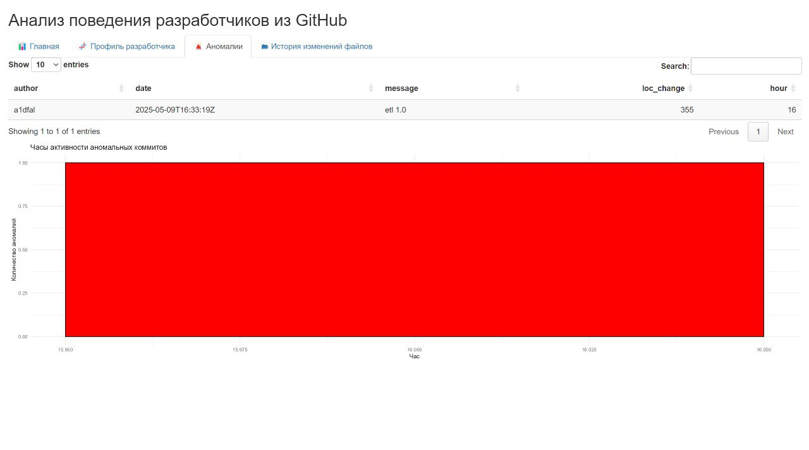
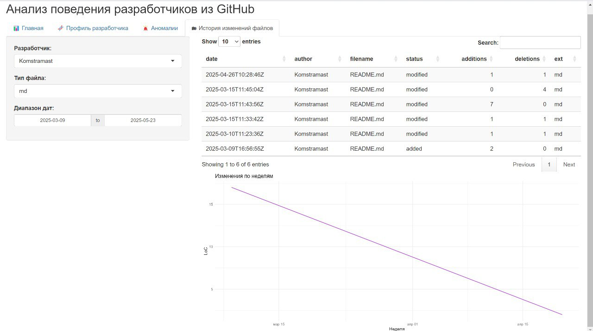

# Group_project_C4

Участники: Паромов Ярослав, Смирницкий Константин, Трегубов Павел, Сапожников Артём

Капитан команды: Паромов Ярослав

Руководитель: [i2z1](https://github.com/i2z1)

## **Презентация проекта**

Обзор проекта от идеи до реализации представлен `coming soon`

## **Как запустить?**

### **Требования:**

1.  [R версии 4.0 и выше](https://www.r-project.org/)

2.  [Git](https://git-scm.com/)

3.  [RStudio](https://posit.co/download/rstudio-desktop/)

### Первичная настройка

1.  Склонируйте репозиторий:

    `git clone https://github.com/Komstramast/Group_project_C4`

2.  Установите рабочую директорию в R:

    `setwd("путь/к/папке/с/файлами")`

### **Установка пакетов**

Для корректной работы ПО необходимо установить зависимости R-пакетов через команду: ``` install.packages(c( "shiny", "bslib", "shinyWidgets", "shinydashboard", "shinyjs", "jsonlite", "httr", "gh", "dplyr", "data.table", "readr", "DT", "stringr", "lubridate", "glue", "purrr", "``tidyr", "ggplot2", "fmsd" )) ```

### **Запуск через RStudio:**

1.  Откройте репозиторий в RStudio

2.  Откройте проект `Group_project_C4`

3.  Нажмите на кнопку `Run App` в правом верхнем углу панели с кодом

4.  Сначала нужно ввести путь к репозиторию

5.  Далее нужно сгенерировать свою ключ от github api, а затем ввести его

    

### **Используемые пакеты**

**Основные UI-библиотеки:**

1.  `shiny` - базовый фреймворк для создания веб-приложений на R

2.  `shinyWidgets` - дополнительные виджеты и компоненты для улучшения UI в Shiny

3.  `shinydashboard` - создание панелей управления с боковым меню и вкладками

4.  `shinyjs` - дополнительные JavaScript-эффекты и анимации

5.  `bslib` - кастомизация Bootstrap-тем для Shiny-приложений

    **Работа с данными:**

6.  `dplyr` - манипуляции с данными (arrange, select, filter, mutate, summarize)

7.  `tidyr` - преобразование структуры данных

8.  `readr` - удобное и быстрое чтение текстовых файлов (CSV, TSV и др.).

9.  `data.table` - высокопроизводительная работа с большими таблицами, быстрые операции

10. `purrr` - функциональное программирование и работа с итерациями, списками

    **Визуализация:**

11. `ggplot2` - построение статических графиков

12. `fmsd` - создание радар-карт для анализа профилей разработчика

13. `DT` - интерактивные таблицы, отображаемые в Shiny-интерфейсе.

    **Вспомогательные инструменты:**

14. `httr` - упрощённая работа с HTTP-запросами (получение данных с веба)

15. `tools` - работа с файловыми путями и расширениями

16. `stringr` - удобные функции для работы со строками.

17. `jsonlite` - удобное преобразование данных в формат JSON и обратно

18. `glue` - интерполяция строк, удобное форматирование

    **Анализ временных данных:**

19. `lubridate` - обработка дат и времени

## Краткий обзор shiny приложения:

### Главная:

-   автор

-   общее кол-во коммитов

-   среднее кол-во внесённых изменённых строк кода

-   среднее кол-во добавленных строк кода

-   среднее кол-во удалённых строк кода

-   средняя длина сообщений коммитов

-   среднее значение времени суток, в которое делается коммит

<!-- -->

-   кол-во уникальных дней, в которые разработчик делал хотя бы один коммит

<!-- -->

-   среднее количество файлов, изменяемых разработчиком за один коммит



### Профили разработчика:



### Аномалии:



### История изменений файлов:


